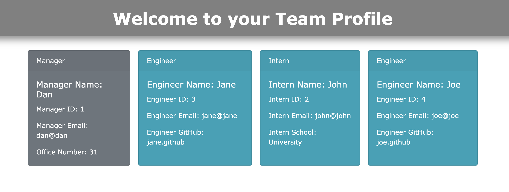

# Team Profile Generator

## Summary

This is a command line application to generate a software engineering team. The application will prompt the user for information about the team manager and then information about the team members. The user can input any number of team members, and they may be a mix of engineers and interns. This assignment also includes unit tests for each employee tests, and passes all tests. When the user has completed building the team, the application creates an HTML file that displays a nicely formatted team roster based on the information provided by the user.

## User Story

As a manager

I want to generate a webpage that displays my team's basic info

so that I have quick access to emails and GitHub profiles

## GitHub Link

https://github.com/danfenichel/employee-summary

## Technologies Used

* HTML/CSS
* JavaScript
* Node.js
* FS (npmjs)
* Inquirer (npmjs)
* Jest (npmjs)s

## Screenshot of Deployed Application

